# CS Fundamentals

Interview-grade theory across OS, Networks, and DBMS. Each section covers **what interviewers ask**, the theory behind it, and how it maps to Java.

---

## Part 1 — Operating Systems

### 1.1 Processes and Threads

A **process** is an independent program in execution with its own memory space. A **thread** is a lightweight unit of execution within a process that shares the process's memory.

#### Process Lifecycle (States)

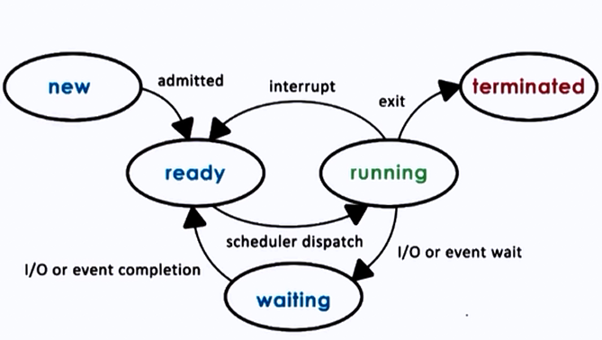{ loading=lazy }

| State | Description |
|-------|-------------|
| **New** | Process is being created |
| **Ready** | Waiting to be assigned to a CPU |
| **Running** | Instructions are being executed |
| **Waiting (Blocked)** | Waiting for an I/O operation or event |
| **Terminated** | Process has finished execution |

#### Process Control Block (PCB)

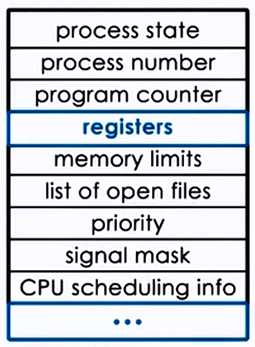{ loading=lazy width=250 }

Every process is represented in the OS by a **PCB**, which contains:

- **Process ID (PID)** — unique identifier
- **Process State** — current lifecycle state
- **Program Counter** — address of the next instruction
- **CPU Registers** — contents of all process-centric registers
- **Memory Management Info** — page tables, segment tables, base/limit registers
- **I/O Status** — list of open files, allocated I/O devices
- **Scheduling Info** — priority, scheduling queue pointers

#### Process vs Thread Comparison

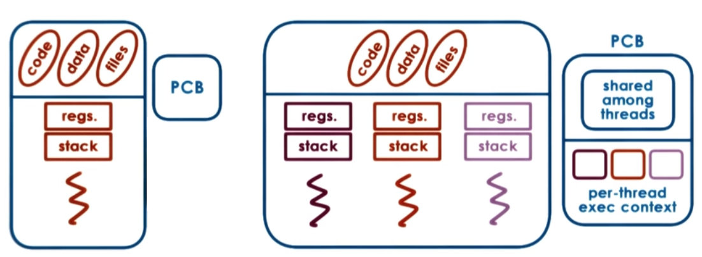{ loading=lazy }

| Feature | Process | Thread |
|---------|---------|--------|
| Memory | Separate address space | Shared memory within process |
| Creation cost | Expensive (fork) | Lightweight |
| Communication | IPC (pipes, sockets, shared memory) | Direct shared memory access |
| Crash impact | Isolated — one crash doesn't affect others | One thread crash can kill the process |
| Context switch | Expensive (TLB flush, page tables) | Cheaper (same address space) |
| Overhead | Higher (own PCB, file descriptors) | Lower (shared resources) |

#### User-Level vs Kernel-Level Threads

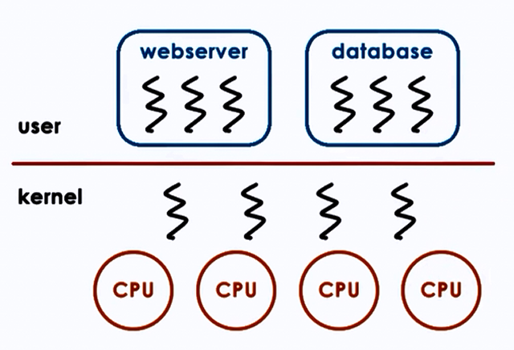{ loading=lazy }

| Feature | User-Level Threads | Kernel-Level Threads |
|---------|-------------------|---------------------|
| Management | Thread library in user space | OS kernel |
| Context switch | Fast (no kernel involvement) | Slower (requires system call) |
| Blocking | One thread blocks → all block | Only the calling thread blocks |
| Multiprocessor | Cannot exploit multiple CPUs | True parallelism |
| Example | Green threads (early Java) | Java `java.lang.Thread` (modern JVMs) |

**Java integration:** Every Java program runs as a process on the JVM. The JVM manages threads internally.

```java
// Creating threads in Java
// Method 1: Extend Thread class
class MyThread extends Thread {
    public void run() {
        System.out.println("Thread: " + Thread.currentThread().getName());
    }
}

// Method 2: Implement Runnable (preferred)
Runnable task = () -> System.out.println("Running in: " + Thread.currentThread().getName());
new Thread(task).start();

// Method 3: ExecutorService (production-grade)
ExecutorService executor = Executors.newFixedThreadPool(4);
executor.submit(() -> {
    System.out.println("Pool thread: " + Thread.currentThread().getName());
});
executor.shutdown();

// Method 4: Virtual Threads (Java 21+ / Project Loom)
Thread.startVirtualThread(() -> {
    System.out.println("Virtual thread: " + Thread.currentThread().getName());
});

// Or with ExecutorService
try (var executor2 = Executors.newVirtualThreadPerTaskExecutor()) {
    executor2.submit(() -> System.out.println("Lightweight!"));
}
```

!!! info "Virtual Threads (Project Loom)"
    Virtual threads are user-mode threads scheduled by the JVM, not the OS. They are extremely lightweight (~1KB stack vs ~1MB for platform threads). Ideal for I/O-bound tasks like HTTP calls, DB queries. **Not** for CPU-bound work.

---

### 1.2 CPU Scheduling

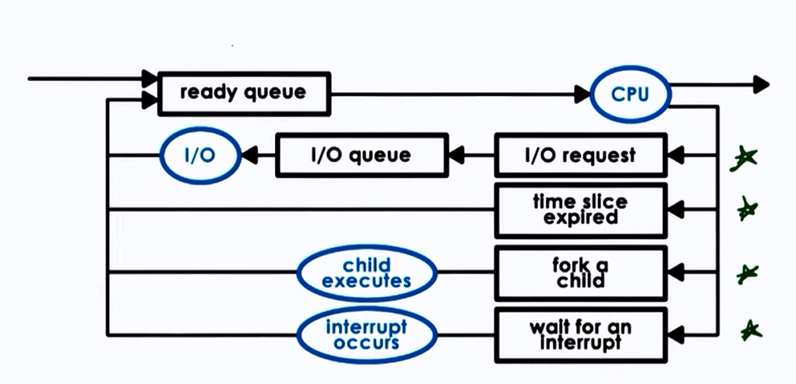{ loading=lazy }

The OS scheduler decides which process/thread runs on the CPU and for how long.

**Key metrics:**

- **CPU Utilization** — keep the CPU as busy as possible
- **Throughput** — number of processes completed per unit time
- **Turnaround Time** — time from submission to completion
- **Waiting Time** — time spent in the ready queue
- **Response Time** — time from submission to first response

| Algorithm | Description | Preemptive? | Pros | Cons |
|-----------|------------|-------------|------|------|
| **FCFS** | Run in arrival order | No | Simple, fair | Convoy effect — short jobs wait behind long ones |
| **SJF** | Shortest burst time runs first | No (or yes: SRTF) | Optimal average waiting time | Starvation of long processes; requires burst prediction |
| **Round Robin** | Each process gets a fixed time slice (quantum) | Yes | Fair, responsive | High context-switch overhead if quantum too small |
| **Priority** | Highest priority runs first | Yes/No | Important tasks prioritized | Starvation of low-priority (solved with **aging**) |
| **Multilevel Queue** | Separate queues for different process types | Yes | Organized, efficient | Inflexible without feedback |
| **Multilevel Feedback Queue** | Processes can move between queues based on behavior | Yes | Adaptive, general purpose | Complex to tune |

!!! tip "Interview Tip: Convoy Effect"
    In FCFS, if a long CPU-burst process arrives first, all shorter processes queue behind it, dramatically increasing average wait time. This is the **convoy effect** — the classic argument against FCFS.

**Linux CFS (Completely Fair Scheduler):**  
Modern Linux uses CFS, which assigns each process a **virtual runtime**. The process with the lowest virtual runtime gets the CPU next. Implemented using a **red-black tree** for O(log n) scheduling decisions.

---

### 1.3 Synchronization

When multiple threads access shared resources concurrently, synchronization is needed to prevent race conditions.

#### Critical Section Problem

Requirements for a correct solution:

1. **Mutual Exclusion** — Only one process in the critical section at a time
2. **Progress** — If no process is in the CS, selection of the next one cannot be postponed indefinitely
3. **Bounded Waiting** — A bound on the number of times other processes enter CS after a process has requested entry

#### Synchronization Primitives

| Primitive | Description | Java Equivalent |
|-----------|-------------|-----------------|
| **Mutex** | Binary lock — one thread at a time | `synchronized`, `ReentrantLock` |
| **Semaphore** | Counter-based — allows N concurrent accesses | `java.util.concurrent.Semaphore` |
| **Monitor** | High-level construct with mutual exclusion + condition variables | Every Java object (intrinsic lock) |
| **Read-Write Lock** | Multiple readers OR one writer | `ReentrantReadWriteLock` |
| **Condition Variable** | Wait/signal mechanism within a monitor | `Condition` from `Lock` |

#### Classic Problems

**Producer-Consumer (Bounded Buffer):**

```java
class BoundedBuffer<T> {
    private final Queue<T> buffer = new LinkedList<>();
    private final int capacity;
    private final ReentrantLock lock = new ReentrantLock();
    private final Condition notFull = lock.newCondition();
    private final Condition notEmpty = lock.newCondition();

    public BoundedBuffer(int capacity) { this.capacity = capacity; }

    public void produce(T item) throws InterruptedException {
        lock.lock();
        try {
            while (buffer.size() == capacity) notFull.await();
            buffer.add(item);
            notEmpty.signal();
        } finally { lock.unlock(); }
    }

    public T consume() throws InterruptedException {
        lock.lock();
        try {
            while (buffer.isEmpty()) notEmpty.await();
            T item = buffer.poll();
            notFull.signal();
            return item;
        } finally { lock.unlock(); }
    }
}
```

**Java Synchronization Options Comparison:**

| Mechanism | Reentrant? | Fairness? | Interruptible? | Try-Lock? | Use Case |
|-----------|-----------|-----------|----------------|-----------|----------|
| `synchronized` | Yes | No | No | No | Simple mutual exclusion |
| `ReentrantLock` | Yes | Optional | Yes | Yes | Advanced locking |
| `StampedLock` | No | No | No | Yes (optimistic) | Read-heavy workloads |
| `volatile` | N/A | N/A | N/A | N/A | Visibility guarantee only |
| `Atomic*` | N/A | N/A | N/A | N/A | Lock-free single-variable updates |

---

### 1.4 Deadlocks

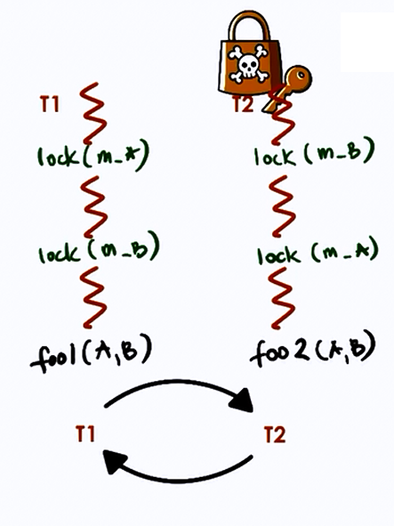{ loading=lazy width=350 }

A deadlock occurs when two or more processes are waiting for each other to release resources, creating a circular dependency.

**Four necessary conditions (all must hold):**

1. **Mutual Exclusion:** Resource held exclusively by one process
2. **Hold and Wait:** Process holds one resource while waiting for another
3. **No Preemption:** Resources cannot be forcibly taken away
4. **Circular Wait:** A circular chain of processes, each waiting for a resource held by the next

**Handling strategies:**

| Strategy | Method | Trade-off |
|----------|--------|-----------|
| **Prevention** | Break one of the four conditions | May reduce concurrency or throughput |
| **Avoidance** | Banker's Algorithm — check safe state before granting | Requires advance knowledge of max resource needs |
| **Detection** | Build wait-for graph, detect cycles | Recovery is costly (kill processes or rollback) |
| **Ignorance** | Ostrich algorithm — do nothing | Used by most OS (Linux, Windows); restart if stuck |

**Banker's Algorithm (Simplified):**

Given `n` processes and `m` resource types, maintain:

- `Available[m]` — currently available resources
- `Max[n][m]` — maximum demand of each process
- `Allocation[n][m]` — currently allocated to each process
- `Need[n][m]` = `Max - Allocation`

A state is **safe** if there exists a sequence in which every process can finish. Before granting a request, simulate the allocation and check if the resulting state is still safe.

**Java deadlock example:**

```java
Object lock1 = new Object(), lock2 = new Object();

// Thread 1: locks lock1, then lock2
new Thread(() -> {
    synchronized (lock1) {
        synchronized (lock2) { /* work */ }
    }
}).start();

// Thread 2: locks lock2, then lock1 — DEADLOCK!
new Thread(() -> {
    synchronized (lock2) {
        synchronized (lock1) { /* work */ }
    }
}).start();

// Fix: Always acquire locks in the same order (lock1 → lock2)
// Or use tryLock with timeout:
ReentrantLock lockA = new ReentrantLock();
ReentrantLock lockB = new ReentrantLock();

if (lockA.tryLock(1, TimeUnit.SECONDS)) {
    try {
        if (lockB.tryLock(1, TimeUnit.SECONDS)) {
            try { /* work */ }
            finally { lockB.unlock(); }
        }
    } finally { lockA.unlock(); }
}
```

---

### 1.5 Memory Management

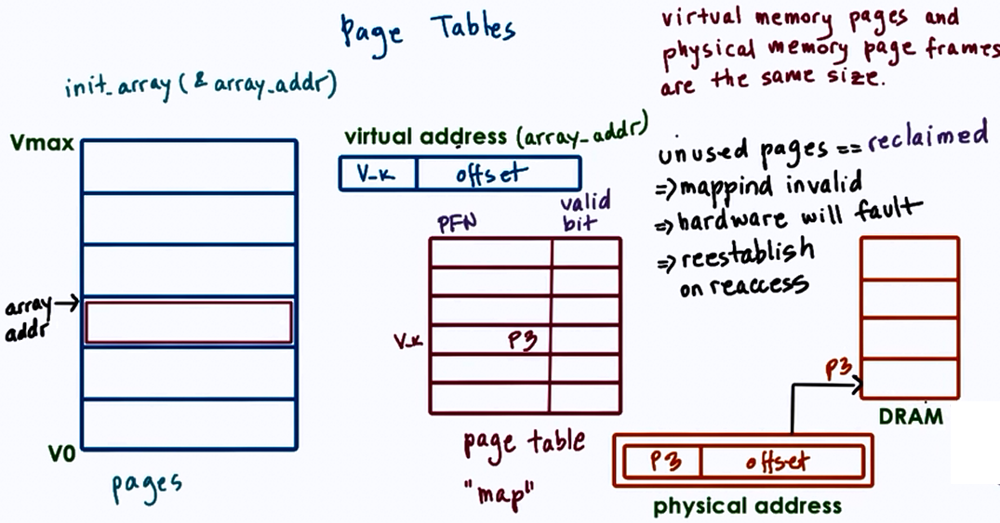{ loading=lazy }

#### Virtual Memory

Virtual memory provides each process with its own address space, decoupled from physical memory. The MMU (Memory Management Unit) translates virtual addresses to physical addresses using **page tables**.

```
Virtual Address → [Page Number | Offset]
                       ↓
               Page Table Lookup
                       ↓
              [Frame Number | Offset] → Physical Address
```

**TLB (Translation Lookaside Buffer):** A hardware cache of recent page table entries. TLB hit = ~1 ns; TLB miss = ~100 ns (page table walk). Context switches flush the TLB (expensive!).

#### Paging

The OS divides physical memory into fixed-size **frames** and virtual memory into **pages** (typically 4KB).

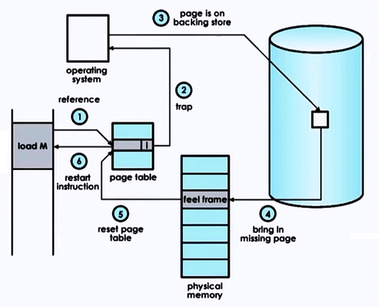{ loading=lazy }

**Page Fault Handling:**

1. Process accesses a page not in physical memory
2. CPU generates a **page fault** trap
3. OS finds the page on disk (swap space)
4. OS selects a victim frame (page replacement algorithm)
5. Loads the page from disk into the free frame
6. Updates the page table
7. Restarts the instruction

#### Page Replacement Algorithms

| Algorithm | How it Works | Pros | Cons |
|-----------|-------------|------|------|
| **FIFO** | Replace the oldest page | Simple | Belady's anomaly — more frames can mean more faults |
| **LRU** | Replace the least recently used page | Good performance | Expensive to implement exactly (needs hardware support) |
| **Optimal (OPT)** | Replace the page not used for longest future time | Theoretical best | Impossible to implement (requires future knowledge) |
| **Clock (Second Chance)** | Circular list with reference bit; skip pages with bit=1 | Approximates LRU cheaply | Not as accurate as true LRU |
| **LFU** | Replace least frequently used page | Handles hot pages well | Pollution from old frequency counts |

**Thrashing:** When a process spends more time paging than executing. Occurs when the **working set** (pages actively used) exceeds available frames. Solution: increase memory, reduce multiprogramming degree, or use working set model.

#### JVM Memory Areas

| Area | Purpose | Thread-shared? |
|------|---------|----------------|
| **Heap** | Object storage, garbage collected | Yes |
| **Stack** | Method frames, local variables, return addresses | No (per thread) |
| **Metaspace** | Class metadata, method info (replaced PermGen in Java 8) | Yes |
| **Program Counter** | Current instruction address per thread | No (per thread) |
| **Native Method Stack** | JNI native method frames | No (per thread) |

**GC Algorithm Comparison:**

| Collector | Pause Type | Best For | Heap Size |
|-----------|-----------|----------|-----------|
| **Serial** | Stop-the-world | Single-threaded apps, small heaps | < 100MB |
| **Parallel** | Stop-the-world (parallel) | Throughput-focused batch processing | Medium |
| **G1** | Mostly concurrent, short pauses | General purpose (default since Java 9) | 4GB–16GB |
| **ZGC** | Sub-millisecond pauses | Ultra-low latency | Up to 16TB |
| **Shenandoah** | Concurrent compaction | Low-latency, RedHat JDK | Large heaps |

---

### 1.6 Inter-Process Communication (IPC)

<div style="display:flex; gap:1rem; flex-wrap:wrap; align-items:center;">
<figure>
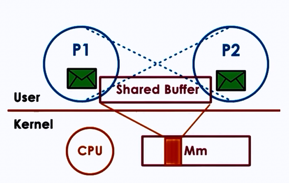
<figcaption>Shared Memory</figcaption>
</figure>
<figure>
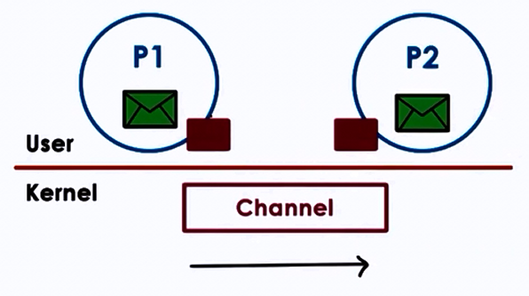
<figcaption>Pipes</figcaption>
</figure>
</div>

| Mechanism | Description | Speed | Use Case |
|-----------|-------------|-------|----------|
| **Pipes** | Unidirectional byte stream between related processes | Fast | Parent-child communication |
| **Named Pipes (FIFOs)** | Pipe with a filesystem name, unrelated processes | Fast | Simple producer-consumer |
| **Message Queues** | Kernel-managed message passing | Medium | Decoupled communication |
| **Shared Memory** | Processes map same physical memory region | Fastest | High-throughput data sharing |
| **Sockets** | Network-capable endpoint (TCP/UDP) | Variable | Cross-machine communication |
| **Signals** | Asynchronous notification (SIGKILL, SIGTERM, etc.) | Instant | Process control/notification |

**Java IPC:**

```java
// Sockets (most common for Java services)
// Server
ServerSocket server = new ServerSocket(9090);
Socket client = server.accept();
BufferedReader in = new BufferedReader(new InputStreamReader(client.getInputStream()));

// Java NIO Channels (non-blocking I/O)
SocketChannel channel = SocketChannel.open();
channel.configureBlocking(false);
channel.connect(new InetSocketAddress("localhost", 9090));

// Memory-mapped files (shared memory in Java)
try (FileChannel fc = FileChannel.open(Path.of("shared.dat"),
        StandardOpenOption.READ, StandardOpenOption.WRITE)) {
    MappedByteBuffer buffer = fc.map(FileChannel.MapMode.READ_WRITE, 0, 1024);
    buffer.putInt(42); // Write
    buffer.flip();
    int value = buffer.getInt(); // Read
}
```

---

### 1.7 I/O Management

**Blocking vs Non-Blocking I/O:**

| Model | Behavior | Java API | Use Case |
|-------|----------|----------|----------|
| **Blocking I/O** | Thread waits until I/O completes | `java.io` (InputStream, OutputStream) | Simple apps, thread-per-connection |
| **Non-Blocking I/O** | Thread checks and continues; polls for readiness | `java.nio` (Channels, Selectors) | High-concurrency servers |
| **Async I/O** | Kernel notifies on completion via callback | `AsynchronousSocketChannel` | Event-driven architectures |
| **I/O Multiplexing** | One thread monitors multiple file descriptors | `Selector` (NIO) | Scalable network servers (Netty) |

**Disk I/O Scheduling Algorithms:**

| Algorithm | Description |
|-----------|-------------|
| **FCFS** | Service in order of arrival |
| **SSTF** | Shortest Seek Time First — nearest request |
| **SCAN (Elevator)** | Move head in one direction, service requests; reverse at end |
| **C-SCAN** | Like SCAN but only services in one direction; jumps back to start |
| **LOOK / C-LOOK** | Like SCAN/C-SCAN but reverses at the last request, not the end |

---

## Part 2 — Computer Networks

_Based on Kurose & Ross, Computer Networking: A Top-Down Approach, Edition 6_

### 2.1 Network Layer Models

#### OSI Model (7 Layers)

| Layer | Name | Function | Protocol Examples |
|-------|------|----------|-------------------|
| 7 | **Application** | User-facing services, process-to-process communication | HTTP, FTP, SMTP, DNS, DHCP |
| 6 | **Presentation** | Syntax/semantics of data, encryption, compression | SSL/TLS, JPEG, ASCII, MPEG |
| 5 | **Session** | Dialog control, token management, synchronization/checkpointing | NetBIOS, RPC |
| 4 | **Transport** | Reliable/unreliable end-to-end delivery, flow control | TCP, UDP |
| 3 | **Network** | Routing, logical addressing (IP) | IP, ICMP, ARP, OSPF |
| 2 | **Data Link** | Framing, MAC addressing, error detection | Ethernet, Wi-Fi (802.11), PPP |
| 1 | **Physical** | Raw bit transmission over physical medium | Cables, fiber optics, radio |

!!! info "Session Layer Details"
    - **Dialog Control:** Determines whose turn it is to transmit
    - **Token Management:** Prevents two parties from attempting the same crucial operation simultaneously
    - **Synchronization:** Checkpointing long transmissions to recover from crashes

#### TCP/IP Model (4 Layers)

| TCP/IP Layer | Equivalent OSI Layer(s) |
|-------------|------------------------|
| **Link** (Network Interface) | Data Link + Physical |
| **Internet** | Network |
| **Transport** | Transport |
| **Application** | Session + Presentation + Application |

---

### 2.2 Application Layer

#### Transport Services Available to Applications

| Service | Description |
|---------|-------------|
| **Reliable Data Transfer** | Guarantee that data arrives correctly and completely |
| **Throughput** | Guarantee a minimum bit rate |
| **Timing** | Guarantee maximum delay (e.g., < 100ms) |
| **Security** | Encryption, data integrity, authentication |

#### TCP vs UDP Services

| Feature | TCP | UDP |
|---------|-----|-----|
| Connection | **Connection-oriented** (3-way handshake) | **Connectionless** — no handshake |
| Reliability | Guaranteed delivery, in-order | No guarantee; may arrive out of order |
| Flow control | Yes (receive window) | No |
| Congestion control | Yes | No — can pump data at any rate |
| Speed | Slower (overhead) | Faster |
| Use cases | HTTP, email, file transfer | DNS, video streaming, gaming, NTP |

---
#### HTTP (HyperText Transfer Protocol)

**HTTP is an application-level protocol that uses TCP as underlying transport, typically on port 80. HTTP is stateless — the server maintains no information about past client requests.**

The server sends requested files to clients without storing any state information. If a client asks for the same object twice, the server resends it — it has completely forgotten what it did earlier.

##### HTTP Message Format

**Request Message:**

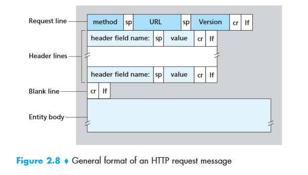{ loading=lazy }

```text
GET /somedir/page.html HTTP/1.1
Host: www.someschool.edu
Connection: close
User-agent: Mozilla/5.0
Accept-language: fr
```

| Line | Component | Purpose |
|------|-----------|---------|
| 1 | **Request line** | Method + URL + Version |
| 2-5 | **Header lines** | Additional info (host, connection type, user agent) |
| (empty line) | Separator | Marks end of headers |
| (body) | **Entity body** | Used with POST/PUT; empty for GET |

**Response Message:**

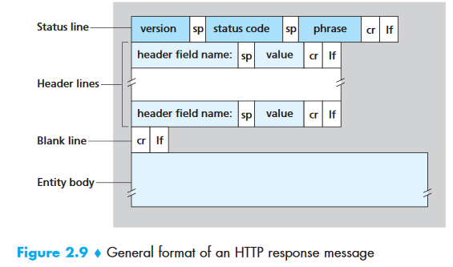{ loading=lazy }

```text
HTTP/1.1 200 OK
Connection: close
Date: Tue, 09 Aug 2011 15:44:04 GMT
Server: Apache/2.2.3 (CentOS)
Last-Modified: Tue, 09 Aug 2011 15:11:03 GMT
Content-Length: 6821
Content-Type: text/html

(data data data data data ...)
```

##### Common HTTP Status Codes

| Code | Meaning | Description |
|------|---------|-------------|
| **200** | OK | Request succeeded, information returned in response |
| **201** | Created | Resource successfully created (POST) |
| **204** | No Content | Success, no body returned (DELETE) |
| **301** | Moved Permanently | Resource moved; new URL in `Location:` header. Client auto-redirects |
| **304** | Not Modified | Cached version is still valid (conditional GET) |
| **400** | Bad Request | Server could not understand the request |
| **401** | Unauthorized | Missing or invalid authentication |
| **403** | Forbidden | Authenticated but not authorized |
| **404** | Not Found | Requested document does not exist |
| **500** | Internal Server Error | Unhandled server exception |
| **503** | Service Unavailable | Server temporarily overloaded or in maintenance |
| **505** | HTTP Version Not Supported | Requested HTTP version not supported |

##### HTTP Versions

| Version | Key Feature |
|---------|------------|
| **HTTP/1.0** | Non-persistent connections (new TCP connection per object) |
| **HTTP/1.1** | **Persistent connections** (default), pipelining, `Host` header required |
| **HTTP/2** | Binary framing, multiplexing (multiple requests on one connection), header compression, server push |
| **HTTP/3** | Uses **QUIC** (UDP-based), eliminates head-of-line blocking |

---

#### FTP (File Transfer Protocol)

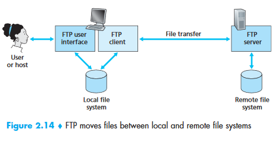{ loading=lazy }

**FTP is an application layer protocol that runs on top of TCP. It uses two parallel connections for file transfer: a control connection and a data connection.**

```
                   ┌──────────────────────┐
                   │     FTP Client       │
                   │                      │
                   │  User Interface      │
                   └──────┬───────┬───────┘
              Control     │       │    Data
           Connection     │       │  Connection
             (Port 21)    │       │  (Port 20)
                   ┌──────▼───────▼───────┐
                   │     FTP Server       │
                   └──────────────────────┘
```

| Aspect | FTP | HTTP |
|--------|-----|------|
| Control info | **Out-of-band** (separate control connection) | **In-band** (same connection) |
| State | **Stateful** (tracks user directory, session) | **Stateless** |
| Connections | Two: control (persistent) + data (non-persistent, one per file) | One per request (or persistent in HTTP/1.1) |

**FTP Commands:**

| Command | Purpose |
|---------|---------|
| `USER username` | Send user identification |
| `PASS password` | Send user password |
| `LIST` | List files in current remote directory (sent over new data connection) |
| `RETR filename` | Retrieve (download) a file |
| `STOR filename` | Store (upload) a file |

**FTP Reply Codes:** `331` Username OK, password required · `125` Data connection open; transfer starting · `425` Can't open data connection · `452` Error writing file

---

#### SMTP (Simple Mail Transfer Protocol)

**SMTP is a push protocol that uses TCP port 25. The client who wants to send mail opens a TCP connection to the SMTP server and then sends the mail across the connection.**

**Email delivery flow:**

```
Alice's UA → Alice's Mail Server → (SMTP over TCP) → Bob's Mail Server → Bob's UA
```

1. Alice composes message, sends to her mail server (message queue)
2. Client SMTP on Alice's server opens TCP connection to Bob's mail server
3. After SMTP handshaking, sends the message
4. Bob's mail server places message in Bob's mailbox
5. Bob reads at his convenience

**SMTP uses persistent connections** and does not generally use intermediate mail servers.

##### HTTP vs SMTP

| Feature | HTTP | SMTP |
|---------|------|------|
| Direction | **Pull** protocol — client pulls data from server | **Push** protocol — sender pushes to receiver |
| TCP initiated by | Machine that wants to **receive** | Machine that wants to **send** |
| Data format | No restriction | **7-bit ASCII** required (binary must be encoded) |
| Multiple objects | Each object in its own response message | All objects in **one message** |

##### Mail Access Protocols

| Protocol | Port | Stateful? | Key Feature |
|----------|------|-----------|-------------|
| **POP3** | 110 | No (download-and-delete or download-and-keep) | Simple; 3 phases: authorization, transaction, update |
| **IMAP** | 143 | Yes (folders, state across sessions) | Folders, search, partial message fetch (good for low bandwidth) |
| **Web-based** | 80/443 | Via HTTP | Gmail, Outlook.com — uses HTTP between browser and mail server |

!!! tip "Interview Tip"
    POP3 is **stateless across sessions** — it downloads mail and optionally deletes from server. IMAP **maintains state** — folder structure, which messages are read, etc. Between mail servers, SMTP is always used regardless of how users access their mail.

---

#### DNS (Domain Name System)

**DNS is a host name to IP address translation service. It is a distributed database implemented in a hierarchy of name servers. It is an application layer protocol using UDP on port 53.**

##### DNS Services

| Service | Description |
|---------|-------------|
| **Hostname → IP translation** | Primary function: `www.google.com` → `142.250.80.14` |
| **Host aliasing** | Canonical name `relay1.west-coast.enterprise.com` can have aliases `www.enterprise.com` |
| **Mail server aliasing** | MX record maps `hotmail.com` to actual mail server hostname |
| **Load distribution** | DNS rotation — responds with a set of IP addresses in different orders to distribute traffic |

##### DNS Hierarchy

```
                        Root DNS Servers (13 clusters)
                       /        |         \
                    .com       .org       .edu        ← TLD Servers
                   /    \       |          |
             google.com  ...  wikipedia.org  mit.edu  ← Authoritative Servers
```

**Resolution process:**

1. Client queries **local DNS resolver** (recursive resolver, e.g., ISP or 8.8.8.8)
2. Resolver queries **root server** → returns TLD server address
3. Resolver queries **TLD server** (.com) → returns authoritative server address
4. Resolver queries **authoritative server** → returns the IP address
5. IP cached at each level with TTL

**DNS Record Types:**

| Type | Maps | Example |
|------|------|---------|
| **A** | Hostname → IPv4 | `www.example.com → 93.184.216.34` |
| **AAAA** | Hostname → IPv6 | `www.example.com → 2606:2800:220:1:...` |
| **CNAME** | Alias → Canonical name | `blog.example.com → example.wordpress.com` |
| **MX** | Domain → Mail server | `example.com → mail.example.com` |
| **NS** | Domain → Name server | `example.com → ns1.example.com` |
| **TXT** | Domain → Text (verification, SPF) | `example.com → "v=spf1 ..."` |

---

#### Peer-to-Peer (P2P) and BitTorrent

<div style="display:flex; gap:1rem; flex-wrap:wrap; align-items:flex-start;">
<figure>
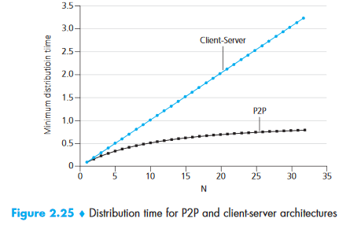
<figcaption>Distribution Time</figcaption>
</figure>
<figure>
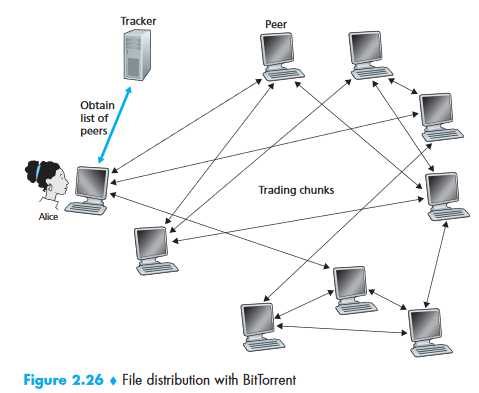
<figcaption>BitTorrent Architecture</figcaption>
</figure>
</div>

In P2P file distribution, the minimum distribution time scales as:

`D_P2P ≥ max{ F/u_s, F/d_min, NF/(u_s + Σu_i) }`

Where `F` = file size, `u_s` = server upload, `d_min` = min client download, `N` = number of peers.

**BitTorrent Decisions:**

| Decision | Strategy | Description |
|----------|----------|-------------|
| Which chunks to request? | **Rarest First** | Request the chunk with fewest copies among neighbors → equalizes distribution |
| Which neighbors to serve? | **Tit-for-Tat** | Send to the 4 peers uploading to you at the highest rate (**unchoked**) |
| Discovery? | **Optimistic Unchoking** | Every 30 seconds, randomly pick one additional peer to send to — allows new peers to get started |

---

#### Other Application Layer Protocols

| Protocol | Transport | Port | Purpose |
|----------|-----------|------|---------|
| **DHCP** | UDP | 67/68 | Dynamic IP assignment (subnet mask, router, DNS) |
| **SNMP** | UDP | 161/162 | Network monitoring and management |
| **HTTPS** | TCP | 443 | HTTP + TLS/SSL encryption (PKI-based) |
| **NTP** | UDP | 123 | Time synchronization |
| **TFTP** | UDP | 69 | Trivial file transfer (no authentication) |

---

### 2.3 Transport Layer

The transport layer provides **logical communication** between application processes running on different hosts. From the application's perspective, it appears as if the hosts are directly connected.

!!! info "Key Distinction"
    The transport layer is implemented **only in end systems**, NOT in intermediate routers.

#### Multiplexing and Demultiplexing

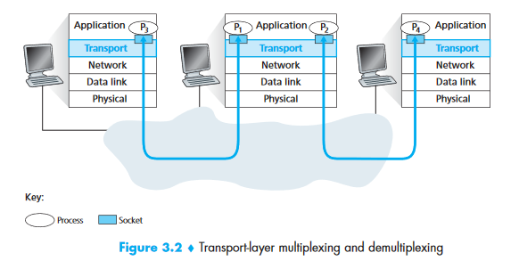{ loading=lazy }

- **Multiplexing** (at sender): Gathering data from multiple sockets, adding headers, passing segments to network layer
- **Demultiplexing** (at receiver): Delivering data to the correct socket based on header info

Port numbers are 16-bit (0–65535). Ports 0–1023 are **well-known** (reserved: HTTP=80, FTP=21, SSH=22).

**Critical difference:**

| | TCP Socket ID | UDP Socket ID |
|-|---------------|---------------|
| Identified by | **4-tuple:** (src IP, src port, dst IP, dst port) | **2-tuple:** (dst IP, dst port) |
| Implication | Different source IPs → different sockets | All clients to same port share one socket |

---

#### UDP (User Datagram Protocol)

UDP is connectionless. No handshaking. Unreliable — no delivery guarantee. No congestion control.

##### UDP Segment Structure

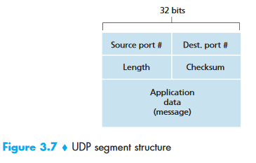{ loading=lazy width=300 }

```
  0               15 16              31
  ┌─────────────────┬─────────────────┐
  │   Source Port    │  Dest Port      │  ← 2 bytes each
  ├─────────────────┼─────────────────┤
  │     Length       │   Checksum      │  ← 2 bytes each
  ├─────────────────┴─────────────────┤
  │          Application Data         │
  │              (payload)            │
  └───────────────────────────────────┘
         Total Header: 8 bytes
```

**Length** = header (8 bytes) + payload.

##### UDP Checksum Calculation

1. Sum all 16-bit words (header + pseudo-header from IP + data)
2. Wrap around any overflow
3. Take 1's complement of the sum → checksum
4. At receiver: sum all words + checksum → should be `1111111111111111`

**Example:**

```
  0110011001100000
+ 0101010101010101
= 1011101110110101

+ 1000111100001100
= 0100101011000010  (overflow wrapped)

Checksum = 1011010100111101  (1's complement)
```

!!! warning "Unlike TCP, checksum is optional in UDP (IPv4). No error control or flow control."

**Protocols using UDP:** DNS, NTP, DHCP, BOOTP, TFTP, RTSP, RIP, OSPF, SNMP.

---

#### TCP (Transmission Control Protocol)

TCP provides **reliable, in-order, byte-stream** delivery with flow control and congestion control.

- **Full-duplex:** Both sides send simultaneously
- **Point-to-point:** Always between exactly two endpoints (no multicast)
- **Connection-oriented:** 3-way handshake before data transfer

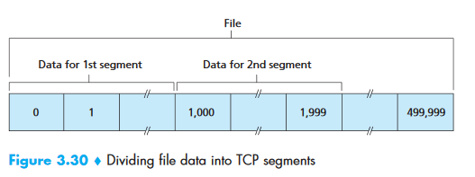{ loading=lazy }

##### TCP Segment Structure

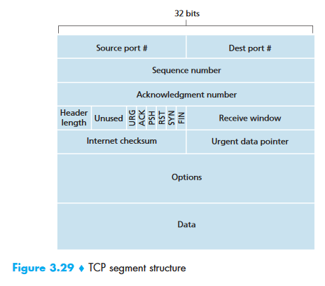{ loading=lazy }

```
  0                   1                   2                   3
  0 1 2 3 4 5 6 7 8 9 0 1 2 3 4 5 6 7 8 9 0 1 2 3 4 5 6 7 8 9 0 1
  ┌───────────────────────┬───────────────────────┐
  │     Source Port (16)  │  Destination Port (16)│
  ├───────────────────────┴───────────────────────┤
  │              Sequence Number (32)             │
  ├───────────────────────────────────────────────┤
  │          Acknowledgment Number (32)           │
  ├────────┬──────┬───────────────────────────────┤
  │ Header │ Resv │U│A│P│R│S│F│  Receive         │
  │ Length │      │R│C│S│S│Y│I│  Window (16)      │
  │  (4)   │ (6)  │G│K│H│T│N│N│                   │
  ├────────┴──────┴───────┬───────────────────────┤
  │    Checksum (16)      │  Urgent Pointer (16)  │
  ├───────────────────────┴───────────────────────┤
  │              Options (variable)               │
  ├───────────────────────────────────────────────┤
  │                    Data                       │
  └───────────────────────────────────────────────┘
        Typical Header: 20 bytes (no options)
```

**Flag bits:**

| Flag | Purpose |
|------|---------|
| **SYN** | Connection setup |
| **ACK** | Acknowledgment field is valid |
| **FIN** | Connection teardown |
| **RST** | Reset connection (abort) |
| **PSH** | Push data to application immediately |
| **URG** | Urgent data pointer is valid |

##### Sequence Numbers and Acknowledgments

- **Sequence number:** The byte-stream number of the **first byte** in the segment
- **Acknowledgment number:** The sequence number of the **next byte expected** from the other side

**Example:** File = 500,000 bytes, MSS = 1,000 bytes → 500 segments. First segment: seq=0, second: seq=1000, third: seq=2000...

**Cumulative acknowledgments:** TCP only acknowledges bytes up to the first missing byte. If bytes 0-535 and 900-1000 are received but 536-899 are missing, ACK = 536.

**MSS vs MTU:**

- **MTU (Maximum Transmission Unit):** Largest link-layer frame (Ethernet = 1500 bytes)
- **MSS (Maximum Segment Size):** MTU – TCP/IP header (typically 40 bytes) = **1460 bytes** (max application data per segment)

##### RTT Estimation and Timeout

```
EstimatedRTT = (1 - α) × EstimatedRTT + α × SampleRTT     [α = 0.125]
DevRTT = (1 - β) × DevRTT + β × |SampleRTT - EstimatedRTT| [β = 0.25]
TimeoutInterval = EstimatedRTT + 4 × DevRTT
```

This is an **Exponential Weighted Moving Average (EWMA)**. Initial `TimeoutInterval` = 1 second. On timeout, the interval is doubled (exponential backoff). On receiving an ACK, recalculate using the formulas.

!!! tip "Interview Note"
    `SampleRTT` is only measured for segments transmitted once (never for retransmissions), and only one measurement is taken at a time.

---

##### TCP Connection Management (3-Way Handshake)

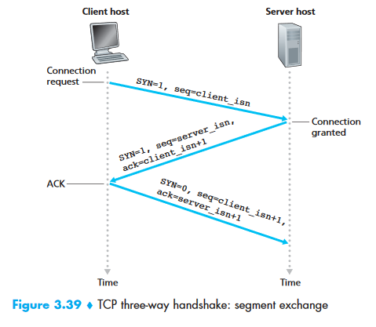{ loading=lazy }

```
Client                              Server
  │                                    │
  │──── SYN (seq=client_isn) ─────────▶│  Step 1: SYN segment
  │                                    │
  │◀── SYN+ACK (seq=server_isn,  ──────│  Step 2: SYNACK segment
  │          ack=client_isn+1)         │
  │                                    │
  │──── ACK (seq=client_isn+1,  ──────▶│  Step 3: ACK (may carry data)
  │          ack=server_isn+1)         │
  │                                    │
  │         Connection Established     │
```

**Step 1:** Client sends SYN with random initial sequence number (`client_isn`).

**Step 2:** Server allocates buffers/variables, sends SYN-ACK with its own `server_isn` and `ack=client_isn+1`.

**Step 3:** Client allocates buffers/variables, sends ACK with `ack=server_isn+1`. This segment **can carry data**.

!!! warning "SYN Flood Attack"
    The server allocates resources at Step 2, before the handshake completes. An attacker can send many SYN segments from spoofed IPs, exhausting server resources. **SYN cookies** are the defense.

**Connection Teardown (4-Way):**

```
Client                              Server
  │── FIN ──────────────────────────▶│
  │◀─────────────────────── ACK ─────│
  │◀─────────────────────── FIN ─────│
  │── ACK ──────────────────────────▶│
  │     (TIME_WAIT: 2×MSL)          │
```

---

##### Flow Control

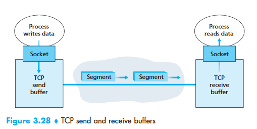{ loading=lazy width=450 }

Flow control prevents the sender from overwhelming the receiver. Each side advertises its **receive window (`rwnd`)** — the available buffer space.

```
Constraint: LastByteSent - LastByteAcked ≤ rwnd
```

**Zero-window problem:** If receiver advertises `rwnd=0`, sender stops. But how does sender know when buffer clears? TCP requires sender to continue sending **1-byte probe segments** when `rwnd=0`. These probes trigger ACKs with updated `rwnd`.

---

##### Congestion Control

**Congestion window (`cwnd`):** Limits how much unacknowledged data can be in flight.

```
Effective window: min(cwnd, rwnd)
LastByteSent - LastByteAcked ≤ min(cwnd, rwnd)
```

**Phases:**

| Phase | Behavior | Trigger to Next Phase |
|-------|----------|----------------------|
| **Slow Start** | `cwnd` doubles every RTT (exponential growth) | `cwnd` reaches `ssthresh` |
| **Congestion Avoidance** | `cwnd` increases by 1 MSS per RTT (linear/additive increase) | Packet loss detected |
| **Fast Recovery** | On 3 duplicate ACKs: `ssthresh = cwnd/2`, `cwnd = ssthresh + 3` | New ACK → congestion avoidance |

**On timeout:** `ssthresh = cwnd/2`, `cwnd = 1 MSS`, restart slow start.

**On 3 duplicate ACKs (fast retransmit):** `ssthresh = cwnd/2`, `cwnd = ssthresh`, enter congestion avoidance (TCP Reno) or fast recovery.

**AIMD:** TCP uses Additive Increase, Multiplicative Decrease — increases linearly, halves on loss. This creates the classic **TCP sawtooth** pattern.

**Congestion Control Algorithms:**

| Algorithm | Description |
|-----------|-------------|
| **Leaky Bucket** | Fixed-rate output regardless of input burst. Smooths traffic. |
| **Token Bucket** | Tokens generated at rate `r`, bucket holds `b` tokens. Allows bursts up to `b` but sustained rate ≤ `r`. |

---

### 2.4 Java Networking Integration

```java
// HTTP Client (Java 11+)
HttpClient client = HttpClient.newHttpClient();
HttpRequest request = HttpRequest.newBuilder()
    .uri(URI.create("https://api.example.com/users"))
    .header("Content-Type", "application/json")
    .GET()
    .build();
HttpResponse<String> response = client.send(request, HttpResponse.BodyHandlers.ofString());
System.out.println(response.statusCode()); // 200
System.out.println(response.body());

// TCP Socket programming
// Server side
ServerSocket server = new ServerSocket(8080);
Socket clientSocket = server.accept(); // blocks until client connects
BufferedReader in = new BufferedReader(new InputStreamReader(clientSocket.getInputStream()));
String message = in.readLine();

// UDP Socket programming
DatagramSocket socket = new DatagramSocket(9090);
byte[] buf = new byte[1024];
DatagramPacket packet = new DatagramPacket(buf, buf.length);
socket.receive(packet); // blocks
String received = new String(packet.getData(), 0, packet.getLength());

// Spring Boot handles HTTP via @RestController
@RestController
@RequestMapping("/api/users")
public class UserController {
    @GetMapping("/{id}")
    public ResponseEntity<User> getUser(@PathVariable Long id) {
        return ResponseEntity.ok(userService.findById(id));
    }
}
```

---

## Part 3 — Database Management Systems (DBMS)

### 3.1 ER Diagrams and Schema Design

**Key concepts:**

- **Entity:** A real-world object (User, Order, Product)
- **Attribute:** A property of an entity (name, email, price)
- **Primary Key:** Unique identifier for each record
- **Foreign Key:** Reference to a primary key in another table
- **Candidate Key:** Minimal set of attributes that can uniquely identify a tuple
- **Super Key:** Any set of attributes that can uniquely identify a tuple (candidate key + more)

**Relationships:**

| Type | Example | Implementation |
|------|---------|----------------|
| **One-to-One** | User ↔ Profile | FK in either table, or shared PK |
| **One-to-Many** | User → Orders | FK in the "many" side |
| **Many-to-Many** | Students ↔ Courses | Junction/join table |

### 3.2 Normalization

| Normal Form | Rule | Example Violation |
|-------------|------|-------------------|
| **1NF** | Atomic values, no repeating groups | `skills: "Java, Python, Go"` → separate rows |
| **2NF** | 1NF + no partial dependencies | Non-key column depends on part of a composite key |
| **3NF** | 2NF + no transitive dependencies | `zip_code → city` — city depends on zip, not PK |
| **BCNF** | Every determinant is a candidate key | Stricter version of 3NF |

!!! tip "Interview Tip: Denormalization"
    In production, we often **denormalize** for read performance (e.g., storing `order_total` instead of computing it). Trade-off: faster reads vs data redundancy and update anomalies.

### 3.3 ACID Properties

| Property | Meaning | Example |
|----------|---------|---------|
| **Atomicity** | All or nothing | Bank transfer: debit AND credit both succeed, or neither does |
| **Consistency** | Valid state → valid state | Balance cannot go negative if constrained |
| **Isolation** | Concurrent txns don't interfere | Two users buying the last item — only one succeeds |
| **Durability** | Committed data survives crashes | Written to WAL (Write-Ahead Log) before confirming |

#### Transaction Isolation Levels

| Level | Dirty Read | Non-Repeatable Read | Phantom Read | Performance |
|-------|-----------|-------------------|-------------|-------------|
| **READ UNCOMMITTED** | ✅ Possible | ✅ Possible | ✅ Possible | Fastest |
| **READ COMMITTED** | ❌ Prevented | ✅ Possible | ✅ Possible | Fast |
| **REPEATABLE READ** | ❌ Prevented | ❌ Prevented | ✅ Possible | Medium |
| **SERIALIZABLE** | ❌ Prevented | ❌ Prevented | ❌ Prevented | Slowest |

**Anomalies explained:**

- **Dirty Read:** Txn reads data written by another uncommitted txn → if it rolls back, you read garbage
- **Non-Repeatable Read:** Txn reads same row twice, gets different values (another txn committed between reads)
- **Phantom Read:** Txn re-executes a query, gets different set of rows (another txn inserted/deleted)

```java
// Spring: set isolation level per transaction
@Transactional(isolation = Isolation.REPEATABLE_READ)
public void transferFunds(Long fromId, Long toId, BigDecimal amount) {
    // ... transfer logic
}
```

### 3.4 Indexing — Deep Dive

An index is a data structure that speeds up data retrieval at the cost of extra storage and slower writes.

**Without index:** Full table scan — O(n)  
**With B-tree index:** O(log n)

#### B-Tree vs B+ Tree

| Feature | B-Tree | B+ Tree (used by most RDBMS) |
|---------|--------|------------------------------|
| Data pointers | At every node | **Only at leaf nodes** |
| Leaf linkage | No | Linked list connecting leaves |
| Range queries | Slow (tree traversal) | **Fast** (follow leaf links) |
| Fan-out | Lower | Higher (more keys per node = shallower tree) |

#### Index Types

| Type | Description | Use Case |
|------|-------------|----------|
| **Clustered** | Data physically sorted by index key. One per table. | Primary key (default in most RDBMS) |
| **Non-clustered** | Separate structure pointing to data rows | Secondary lookups (email, name) |
| **Composite** | Multi-column index | Queries filtering on multiple columns |
| **Covering** | Index includes all columns needed by query | Avoids table lookup entirely |
| **Hash** | O(1) exact match | Equality checks only (no range) |

```sql
-- Create index on frequently queried column
CREATE INDEX idx_users_email ON users(email);

-- Composite index for multi-column queries
-- Column order matters! (leftmost prefix rule)
CREATE INDEX idx_orders_user_date ON orders(user_id, order_date);

-- When to index:
-- YES: columns in WHERE, JOIN, ORDER BY, high cardinality
-- NO: small tables, low cardinality columns, heavily updated tables
```

### 3.5 SQL Joins

```sql
-- INNER JOIN: only matching rows from both tables
SELECT u.name, o.total
FROM users u INNER JOIN orders o ON u.id = o.user_id;

-- LEFT JOIN: all rows from left table, matching from right (NULL if no match)
SELECT u.name, o.total
FROM users u LEFT JOIN orders o ON u.id = o.user_id;

-- Common interview question: find users with no orders
SELECT u.name FROM users u
LEFT JOIN orders o ON u.id = o.user_id
WHERE o.id IS NULL;

-- SELF JOIN: employees and their managers
SELECT e.name AS employee, m.name AS manager
FROM employees e LEFT JOIN employees m ON e.manager_id = m.id;
```

### 3.6 Transactions and Locking

| Locking Strategy | Description | Java/JPA |
|-----------------|-------------|----------|
| **Pessimistic** | Lock the row when reading; others block until you're done | `@Lock(LockModeType.PESSIMISTIC_WRITE)` |
| **Optimistic** | No lock on read; check version on write; fail if changed | `@Version` annotation |

```java
// Optimistic locking with @Version
@Entity
public class Product {
    @Id private Long id;
    @Version private Long version; // Auto-incremented on each update
    private int stock;
}

// If two transactions read stock=10 and both try to decrement,
// the second one gets OptimisticLockException → retry or fail
```

**Two-Phase Locking (2PL):** A txn must acquire all locks before releasing any.

- **Growing phase:** Acquire locks, no releases
- **Shrinking phase:** Release locks, no acquisitions
- Guarantees serializability but can cause deadlocks

### 3.7 Query Optimization

```sql
-- Use EXPLAIN to understand query execution
EXPLAIN SELECT * FROM users WHERE email = 'john@example.com';

-- Common optimizations:
-- 1. Add indexes on WHERE/JOIN columns
-- 2. Avoid SELECT * — only fetch needed columns
-- 3. Use LIMIT for pagination
-- 4. Avoid functions on indexed columns: WHERE YEAR(created_at) = 2024
--    Instead: WHERE created_at >= '2024-01-01' AND created_at < '2025-01-01'
```

**N+1 Query Problem (JPA):**

```java
// BAD: 1 query for users + N queries for each user's orders
List<User> users = userRepo.findAll(); // 1 query
for (User u : users) {
    u.getOrders().size(); // N queries (lazy loading)
}

// FIX: Fetch join
@Query("SELECT u FROM User u JOIN FETCH u.orders")
List<User> findAllWithOrders(); // 1 query
```

### 3.8 CAP Theorem

In a distributed system, you can guarantee at most **two** of three properties:

| Property | Meaning |
|----------|---------|
| **Consistency** | Every read receives the most recent write |
| **Availability** | Every request receives a response (not necessarily the latest) |
| **Partition Tolerance** | System continues despite network partitions |

Since network partitions are unavoidable in distributed systems, the real choice is **CP vs AP**:

| Type | Trade-off | Examples |
|------|-----------|---------|
| **CP** | Sacrifices availability during partitions | HBase, MongoDB (strong consistency mode), ZooKeeper |
| **AP** | Sacrifices consistency during partitions (eventual consistency) | Cassandra, DynamoDB, CouchDB |
| **CA** | Only possible without partitions (single-node) | Traditional RDBMS (PostgreSQL, MySQL) |

### 3.9 Java + DBMS Integration (JPA/Hibernate)

```java
// Entity mapping
@Entity
@Table(name = "users")
public class User {
    @Id
    @GeneratedValue(strategy = GenerationType.IDENTITY)
    private Long id;

    @Column(nullable = false, unique = true)
    private String email;

    @Column(nullable = false)
    private String name;

    @OneToMany(mappedBy = "user", cascade = CascadeType.ALL, fetch = FetchType.LAZY)
    private List<Order> orders;
}

// Transaction management in Spring
@Service
public class TransferService {

    @Transactional(isolation = Isolation.REPEATABLE_READ, timeout = 30)
    public void transfer(Long fromId, Long toId, BigDecimal amount) {
        Account from = accountRepo.findById(fromId)
            .orElseThrow(() -> new AccountNotFoundException(fromId));
        Account to = accountRepo.findById(toId)
            .orElseThrow(() -> new AccountNotFoundException(toId));

        if (from.getBalance().compareTo(amount) < 0) {
            throw new InsufficientFundsException();
        }

        from.setBalance(from.getBalance().subtract(amount));
        to.setBalance(to.getBalance().add(amount));

        accountRepo.save(from);
        accountRepo.save(to);
        // If any step fails, everything rolls back
    }
}

// Connection pooling (application.yml)
// spring.datasource.hikari.maximum-pool-size: 10
// spring.datasource.hikari.minimum-idle: 5
// spring.datasource.hikari.connection-timeout: 30000
```

---

## Summary — How CS Fundamentals Connect to Java Backend

| CS Concept | Java Backend Application |
|-----------|-------------------------|
| Process lifecycle & PCB | JVM process, thread states (NEW, RUNNABLE, BLOCKED, WAITING, TERMINATED) |
| Threads & concurrency | `ExecutorService`, `@Async`, `Virtual Threads`, reactive programming |
| Synchronization | `synchronized`, `ReentrantLock`, `StampedLock`, `Atomic*`, `ConcurrentHashMap` |
| Deadlocks | Lock ordering, `tryLock` with timeout, `jstack` for detection |
| Memory management | JVM heap/stack, GC tuning (`-Xmx`, `-Xms`), memory leak analysis (VisualVM) |
| Virtual memory / paging | JVM memory-mapped files (`MappedByteBuffer`), off-heap memory |
| CPU scheduling | Thread pools, `ForkJoinPool`, work-stealing algorithm |
| IPC | Sockets, REST APIs, message queues (Kafka, RabbitMQ) |
| I/O models | `java.io` (blocking) vs `java.nio` (non-blocking) vs Netty |
| TCP/IP & 3-way handshake | Socket programming, connection pooling (HikariCP), keep-alive |
| HTTP protocol | Spring `@RestController`, status codes, headers, `RestTemplate`/`WebClient` |
| DNS | Service discovery in microservices (Eureka, Consul) |
| Flow/congestion control | Back-pressure in reactive streams (Project Reactor, RxJava) |
| ACID transactions | `@Transactional`, isolation levels, distributed transactions (Saga pattern) |
| Indexing & B+ trees | JPA `@Index`, query optimization, `EXPLAIN` |
| Normalization | Entity design, relationship mapping, denormalization for reads |
| CAP theorem | Choosing between SQL (CP) and NoSQL (AP) for microservices |
| Locking | `@Version` (optimistic), `@Lock` (pessimistic), distributed locks (Redis) |
