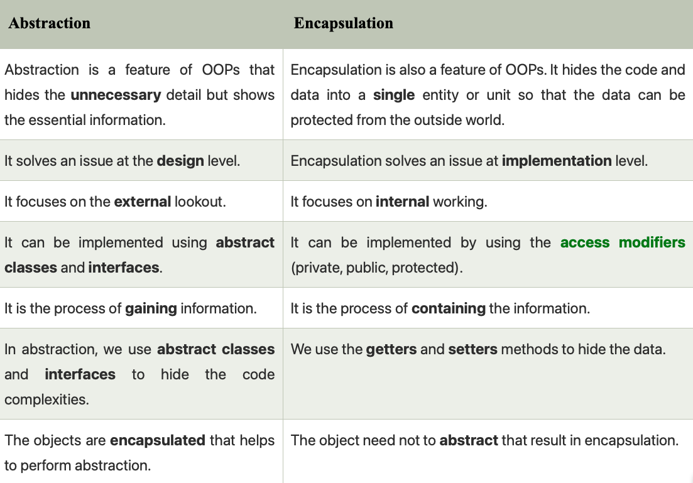

# Object-Oriented Programming (OOP)

Master the core principles of OOP: Encapsulation, Inheritance, Polymorphism, and Abstraction.

<span class="badge badge-intermediate">Intermediate</span> · **3-4 weeks**

---

## What is Object-Oriented Programming?

Object-Oriented Programming (OOP) is a programming paradigm built on the concept of **"objects"**. Instead of writing functions and logic top-to-bottom (Procedural Programming), OOP organizes software design around data, or objects, rather than functions and logic.

### Why do we use OOP?

1. **Modularity:** Code is split into bite-sized, manageable objects that model real-world entities.
2. **Reusability:** Code can be reused through inheritance, meaning you write less repetitive code.
3. **Maintainability:** Bugs are easier to isolate within specific objects, and systems are easier to upgrade.
4. **Security:** Data hiding (encapsulation) protects sensitive data from being changed by mistake.

### The Four Pillars of OOP

Every object-oriented language relies on four core principles:

1. **Encapsulation:** Wrapping data (variables) and code (methods) together as a single secure unit. It hides the internal state of the object and requires all interaction to be performed through an object's public methods (like getters and setters).
2. **Abstraction:** Hiding complex implementation details and showing only the essential features of the object. For example, you know how to drive a car (using the steering wheel and pedals) without knowing how the internal combustion engine works.
3. **Inheritance:** Allowing one class to inherit the fields and methods of another. This promotes code reuse and establishes an "IS-A" parent-child relationship between classes (e.g., `Dog IS-A Animal`).
4. **Polymorphism:** The ability of different objects to respond to the same method call in their own unique way (via method overriding or overloading).

---

## Classes and Objects

Now that we understand the core theory, how do we actually write OOP in Java? It all starts with Classes and Objects.

A class is a blueprint or template for an object, and an object is a concrete instance of a class. A class creates a new custom data type that can be used to construct objects.

When you declare an object of a class, you are creating an instance of that class. Thus, a class is a logical construct. An object has physical reality. (That is, an object occupies space in memory.)

Objects are characterized by three essential properties: **state**, **identity**, and **behavior**. The state of an object is a value from its data type. The identity of an object distinguishes one object from another. The behavior of an object is the effect of data-type operations.

### Memory Allocation

The `new` keyword dynamically allocates memory for an object and returns a reference to it. In Java, all class objects must be dynamically allocated.

```java
Box mybox; // declare reference to object
mybox = new Box(); // allocate a Box object
```

When you assign one object reference variable to another object reference variable, you are not creating a copy of the object, you are only making a copy of the reference. Both will refer to the same object.

---

## Constructors, this, finalize

Once defined, the constructor is automatically called when the object is created, before the `new` operator completes. Constructors have no return type, not even void. The implicit return type is the class type itself.

Any class will have a default constructor, does not matter if we declare it in the class or not. If we inherit a class, then the derived class must call its super class constructor explicitly or implicitly.

### The this Keyword

Sometimes a method will need to refer to the object that invoked it. `this` can be used inside any method to refer to the current object. It is always a reference to the object on which the method was invoked.

### The finalize() Method

Java provides a mechanism called finalization. By using finalization, you can define specific actions that will occur when an object is just about to be reclaimed by the garbage collector.

```java
protected void finalize( ) {
    // finalization code here
}
```

---

## Access Control

How a member can be accessed is determined by the access modifier attached to its declaration. Usually, you will want to restrict access to the data members of a class, allowing access only through methods.

### Modifiers Matrix

| Modifier | Class | Package | Subclass (Same Pkg) | Subclass (Diff Pkg) | World (Diff Pkg & Not Subclass) |
|----------|-------|---------|---------------------|---------------------|---------------------------------|
| **public** | Yes | Yes | Yes | Yes | Yes |
| **protected** | Yes | Yes | Yes | Yes | No |
| **no modifier (default)** | Yes | Yes | Yes | No | No |
| **private** | Yes | No | No | No | No |

---

## Inheritance, super, and final

To inherit a class, incorporate the definition of one class into another using the `extends` keyword. Java does not support the inheritance of multiple superclasses into a single subclass.

### Superclass References

A superclass variable can reference a subclass object. However, you will have access only to those parts of the object defined by the superclass.

### Using super

The keyword `super` has two forms. The first calls the superclass's constructor. The second is used to access a member of the superclass that has been hidden by a member of a subclass.

```java
BoxWeight(double w, double h, double d, double m) {
    super(w, h, d); // call superclass constructor
    weight = m;
}
```

### The final Keyword

The keyword `final` has three uses: to create named constants, to prevent a method from being overridden, and to prevent a class from being inherited.

---

## Polymorphism (Overriding & Overloading)

### Method Overloading (Compile-Time)

Defining two or more methods within the same class that share the same name, as long as their parameter declarations are different. Return type alone is insufficient to distinguish them.

### Method Overriding (Run-Time)

When a method in a subclass has the same name and type signature as a method in its superclass, it overrides the method. Dynamic method dispatch is the mechanism by which a call to an overridden method is resolved at run time, rather than compile time.

---

## Abstraction & Interfaces

### Abstraction vs Encapsulation



### Abstract Classes

You can require that certain methods be overridden by subclasses by specifying the `abstract` type modifier. An abstract class cannot be instantiated, and any subclass must either implement all abstract methods or be declared abstract itself. Abstract classes can have non-abstract methods, final variables, static variables, and constructors.

### Interfaces

Interfaces specify only what the class is doing, not how it is doing it. Variables declared in an interface are implicitly `public static final`, and methods are `public abstract` by default (prior to Java 8).

From Java 8 onwards, interfaces can contain `default` and `static` methods with implementations. The calling code can dispatch through an interface without having to know anything about the callee.

| Feature | Abstract Class | Interface |
|---------|---------------|-----------|
| Inheritance | Can extend one class and implement many interfaces | Can extend multiple interfaces |
| Implementation | Using "extends" | Using "implements" |
| Variables | Final, non-final, static, non-static | Only static and final |
| Constructors | Allowed | Not Allowed |

---

## Packages

Packages are containers for classes used to keep the class name space compartmentalized. They prevent collisions between classes with the same names. Packages are stored in a hierarchical manner corresponding to file system directories.

---

## The static Keyword

When a member is declared static, it can be accessed before any objects of its class are created, and without reference to any object. A static method belongs to the class, not the instance.

A static method can call only other static methods and access static data. It cannot refer to `this` or `super` keywords in any way. You cannot override static methods because they are resolved during compile time.

```java
class UseStatic {
    static int a = 3;
    static int b;
    static {
        System.out.println("Static block initialized.");
        b = a * 4;
    }
}
```

---

## Enumerations

An enumeration defines a class type created using the `enum` keyword. All enums implicitly extend the `java.lang.Enum` class and cannot extend anything else.

Methods like `values()`, `ordinal()`, and `valueOf()` are present inside java.lang.Enum. Enums can contain constructors (executed for each enum constant during class loading), but they must be private or default modifiers.

---

## Next Steps

Master OOP concepts, then move to Data Structures and Algorithms.

[Learn Data Structures & Algorithms :material-arrow-right:](../dsa/index.md){ .md-button .md-button--primary }
